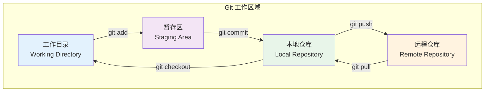
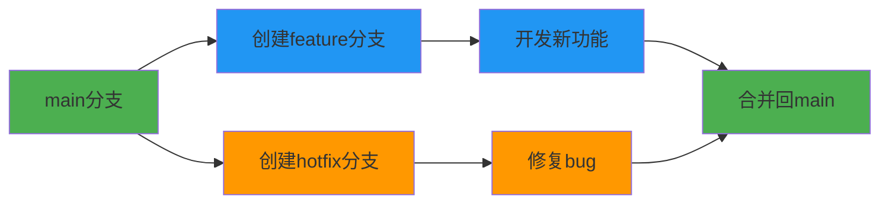
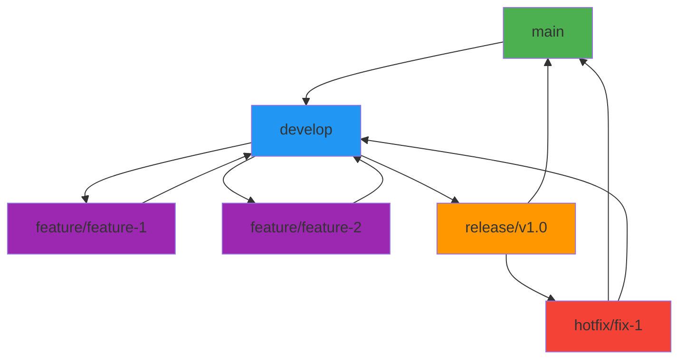

> 本教程适用于 Git 初学者到进阶用户，涵盖日常开发中 90% 的使用场景。

## 什么是 Git

Git 是一个分布式版本控制系统，用于跟踪文件的修改历史。与集中式版本控制系统（如 SVN）不同，Git 的每个工作副本都是完整的仓库，包含项目的完整历史记录。

### Git 的核心概念

- **仓库（Repository）**: 项目的版本控制中心，包含所有文件的历史记录。
- **工作目录（Working Directory）**: 你在本地进行修改的文件所在目录。
- **暂存区（Staging Area）**: 一个中间区域，用于暂存你要提交的文件变更。
- **本地仓库（Local Repository）**: 你在本地计算机上的仓库，包含完整的历史记录。
- **远程仓库（Remote Repository）**: 托管在服务器上的仓库，用于与团队成员共享代码。

### Git 工作流程



## Git 安装与配置

### 安装 Git

**Windows**: 下载并安装 [Git for Windows](https://git-scm.com/download/win)

**macOS**: 
```bash
# 使用 Homebrew
brew install git

# 或者下载安装包
# https://git-scm.com/download/mac
```

**Linux (Ubuntu/Debian)**:
```bash
sudo apt update
sudo apt install git
```

**Linux (CentOS/RHEL)**:
```bash
sudo yum install git
```

### 基础配置

```bash
# 配置用户信息（必须）
git config --global user.name "你的名字"
git config --global user.email "your.email@example.com"

# 配置默认分支名（推荐）
git config --global init.defaultBranch main

# 配置文本编辑器（可选）
git config --global core.editor vim

# 查看配置
 git config --list
```

## Git 基础操作

### 初始化仓库

```bash
# 在当前目录初始化 Git 仓库
git init

# 克隆远程仓库
git clone https://github.com/username/repository.git

# 克隆并指定目录名
git clone https://github.com/username/repository.git my-project
```

### 文件状态管理

```bash
# 查看文件状态
git status

# 添加文件到暂存区
git add filename.txt
git add .                    # 添加所有文件
git add -A                   # 添加所有变更（包括删除）

# 从暂存区移除文件
git reset filename.txt

# 提交变更
git commit -m "提交信息"
git commit -m "标题" -m "详细描述"

# 跳过暂存区直接提交
git commit -am "提交信息"
```

### 查看历史

```bash
# 查看提交历史
git log

# 简洁查看
git log --oneline

# 查看最近5次提交
git log -5

# 查看文件修改历史
git log --follow filename.txt

# 查看每次提交的差异
git log -p

# 查看统计信息
git log --stat
```

### 撤销操作

```bash
# 撤销工作区的修改
git checkout -- filename.txt

# 撤销暂存区的文件
git reset HEAD filename.txt

# 修改最后一次提交
git commit --amend -m "新的提交信息"

# 回退到指定版本
git reset --hard commit-hash

# 软回退（保留修改）
git reset --soft commit-hash
```

## 分支管理

### 分支概念



### 分支操作

```bash
# 查看分支
git branch                    # 本地分支
git branch -r                # 远程分支
git branch -a                # 所有分支

# 创建分支
git branch feature-login
git checkout -b feature-login  # 创建并切换

# 切换分支
git checkout main
git switch main               # Git 2.23+ 新命令

# 合并分支
git merge feature-login

# 删除分支
git branch -d feature-login   # 安全删除
git branch -D feature-login   # 强制删除

# 重命名分支
git branch -m old-name new-name
```

### 解决冲突

当合并分支时出现冲突：

```bash
# 1. 查看冲突文件
git status

# 2. 手动编辑冲突文件
# 删除冲突标记，保留需要的代码

# 3. 标记冲突已解决
git add filename.txt

# 4. 完成合并
git commit
```

## 远程仓库操作

### 连接远程仓库

```bash
# 添加远程仓库
git remote add origin https://github.com/username/repository.git

# 查看远程仓库
git remote -v

# 重命名远程仓库
git remote rename origin github

# 删除远程仓库
git remote remove origin
```

### 推送与拉取

```bash
# 推送到远程仓库
git push origin main

# 首次推送（设置上游分支）
git push -u origin main

# 强制推送（谨慎使用）
git push -f origin main

# 拉取更新
git pull origin main

# 获取更新但不合并
git fetch origin
```

### 标签管理

```bash
# 创建标签
git tag v1.0.0
git tag -a v1.0.0 -m "版本说明"

# 查看标签
git tag

# 推送标签
git push origin v1.0.0
git push origin --tags

# 删除标签
git tag -d v1.0.0
git push origin --delete v1.0.0
```

## 高级功能

### Stash（暂存）

```bash
# 保存当前工作进度
git stash

# 查看保存的进度
git stash list

# 恢复最近保存的进度
git stash pop

# 恢复指定的进度
git stash apply stash@{1}

# 删除保存的进度
git stash drop stash@{0}
```

### Cherry-pick

```bash
# 选择性地合并某个提交
git cherry-pick commit-hash

# 合并多个提交
git cherry-pick commit1 commit2

# 继续合并（解决冲突后）
git cherry-pick --continue
```

### Rebase

```bash
# 交互式 rebase
git rebase -i HEAD~3

# 继续 rebase
git rebase --continue

# 中止 rebase
git rebase --abort

# 跳过当前提交
git rebase --skip
```

### 子模块

```bash
# 添加子模块
git submodule add https://github.com/user/repo.git path/to/submodule

# 初始化子模块
git submodule init

# 更新子模块
git submodule update

# 递归更新
git submodule update --recursive --remote
```

## Git 工作流程

### Git Flow 工作流



### GitHub Flow

1. **创建分支**：从 main 分支创建功能分支
2. **提交修改**：在功能分支上进行开发
3. **创建 Pull Request**：提交代码审查
4. **代码审查**：团队成员进行代码审查
5. **合并分支**：审查通过后合并到 main 分支
6. **部署**：自动或手动部署到生产环境

### GitLab Flow

结合 Git Flow 和 GitHub Flow 的优点，支持多环境部署。

## 实用技巧

### 配置别名

```bash
# 配置常用别名
git config --global alias.st status
git config --global alias.co checkout
git config --global alias.br branch
git config --global alias.ci commit
git config --global alias.unstage 'reset HEAD --'
git config --global alias.last 'log -1 HEAD'
git config --global alias.visual '!gitk'
```

### 忽略文件

创建 `.gitignore` 文件：

```
# 忽略所有 .log 文件
*.log

# 忽略 node_modules 目录
node_modules/

# 忽略 IDE 配置文件
.vscode/
.idea/

# 忽略操作系统文件
.DS_Store
Thumbs.db

# 忽略编译输出
dist/
build/
*.exe
*.dll
```

### 查看文件差异

```bash
# 查看工作区与暂存区的差异
git diff

# 查看暂存区与仓库的差异
git diff --staged

# 查看两个提交的差异
git diff commit1 commit2

# 查看文件的历史修改
git log -p filename.txt
```

### 统计信息

```bash
# 查看提交统计
git shortlog -sn

# 查看代码行数统计
git log --stat

# 查看贡献者
git log --pretty=format:"%an" | sort | uniq -c | sort -nr
```

## 常见问题解决

### 误提交大文件

```bash
# 从仓库中删除大文件
git filter-branch --force --index-filter \
'git rm --cached --ignore-unmatch path/to/large-file' \
--prune-empty --tag-name-filter cat -- --all

# 清理和垃圾回收
git reflog expire --expire=now --all
git gc --prune=now --aggressive
```

### 修改历史提交信息

```bash
# 修改最近一次提交
git commit --amend

# 修改历史提交（交互式）
git rebase -i HEAD~3
```

### 找回丢失的提交

```bash
# 查看引用日志
git reflog

# 恢复到某个状态
git reset --hard HEAD@{1}
```

### 子模块问题

```bash
# 更新子模块
git submodule update --init --recursive

# 克隆包含子模块的仓库
git clone --recursive https://github.com/user/repo.git
```

## 最佳实践

### 提交信息规范

```
类型(范围): 简短描述

详细描述（可选）

Fixes #123
```

**类型说明**：
- `feat`: 新功能
- `fix`: 修复bug
- `docs`: 文档更新
- `style`: 代码格式调整
- `refactor`: 代码重构
- `test`: 测试相关
- `chore`: 构建过程或辅助工具的变动

### 分支命名规范

- `feature/功能名称`：新功能开发
- `bugfix/bug描述`：bug修复
- `hotfix/紧急修复`：紧急修复
- `release/版本号`：发布准备
- `test/测试名称`：测试相关

### 工作流程建议

1. **频繁提交**：小而频繁的提交比大而少的提交更好
2. **明确提交信息**：写清楚提交的目的和内容
3. **及时拉取**：开始工作前拉取最新代码
4. **使用分支**：不要在主分支上直接开发
5. **代码审查**：提交前进行自我审查
6. **保持同步**：定期与远程仓库同步

## 学习资源

### 官方资源
- [Git 官方文档](https://git-scm.com/doc)
- [Pro Git 书籍](https://git-scm.com/book/zh/v2)
- [GitHub Guides](https://guides.github.com/)

### 交互式学习
- [Learn Git Branching](https://learngitbranching.js.org/)
- [GitHub Learning Lab](https://lab.github.com/)
- [Git 小游戏](https://onlywei.github.io/explain-git-with-d3/)

### 可视化工具
- [GitKraken](https://www.gitkraken.com/)
- [SourceTree](https://www.sourcetreeapp.com/)
- [GitHub Desktop](https://desktop.github.com/)

## 总结

Git 是现代软件开发中不可或缺的工具。掌握 Git 不仅能够提高开发效率，还能更好地与团队协作。本教程涵盖了 Git 的核心概念和常用操作，建议通过实践来加深理解。

记住 Git 的学习曲线可能有些陡峭，但一旦掌握，它将成为你开发工具箱中最强大的工具之一。持续练习，遇到问题不要害怕，Git 的强大功能值得你投入时间学习。

---

> 💡 **提示**：Git 命令很多，不需要全部记住。常用的命令熟练掌握即可，其他的可以按需查询。建议收藏本教程作为参考手册。