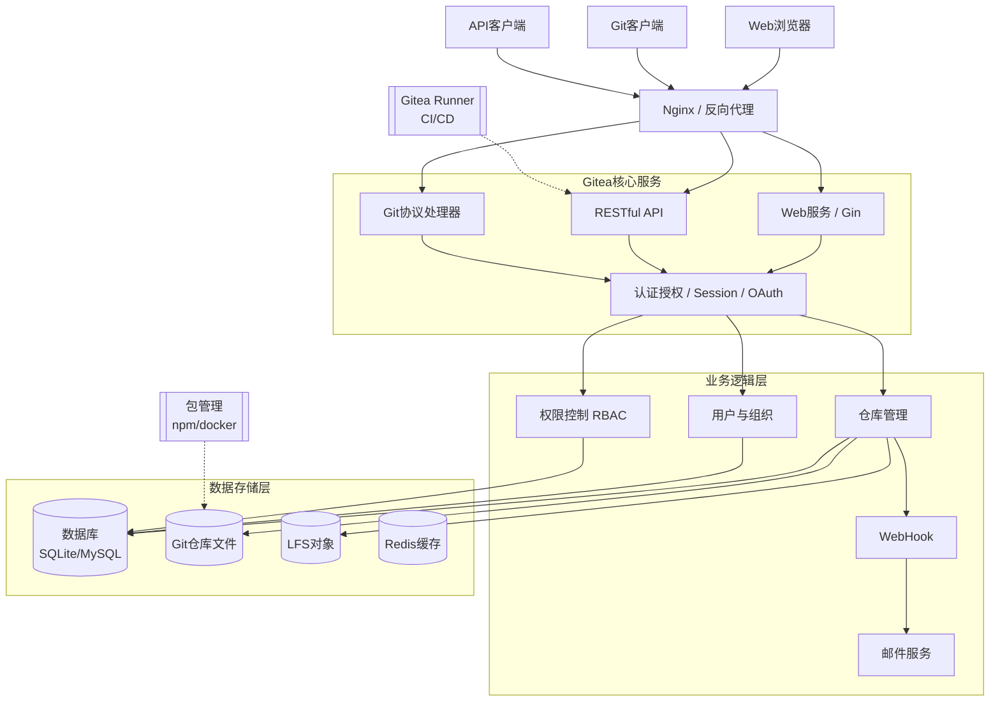

> 注意：本文基于 Docker Compose 一键启动 Gitea + Gitea Runner 的实战记录。

## 为什么使用 gitea
使用 gitea，主要原因是它的内存占用低，只有100 M 左右，而 gitlab 官方推荐的最小配置是 4 G 内存。github 在大多数区域访问速度较慢，而 gitea 可以在自部署的情况下，提供与 github 相同的功能。

## 架构速览

Gitea 采用微内核 + 插件扩展的轻量架构，核心组件如下：

1. **Web 服务层**  
   - 基于 Go 的 HTTP 服务（Gin 框架）  
   - 提供 Web UI、REST & Git 协议入口  

2. **业务逻辑层**  
   - 路由与中间件（鉴权、CSRF、Session）  
   - 仓库管理（Git 命令封装、钩子触发）  
   - 组织/用户/权限模型（RBAC）  

3. **存储层**  
   - **SQLite**（默认，单文件零配置）  
   - **MySQL / PostgreSQL**（生产推荐）  
   - 文件系统：Git 裸仓库、LFS 对象、头像、日志  

4. **后台任务**  
   - 定时器：镜像同步、归档清理、统计更新  
   - 队列：邮件、WebHook、索引构建  

5. **可选扩展**  
   - **Gitea Runner**：基于 act（兼容 GitHub Actions）的 CI 执行器  
   - **包管理**：npm、maven、nuget、docker registry 统一入口  

### 架构图（Mermaid）



### 架构说明

**Gitea** 采用分层架构设计，各层职责清晰：

1. **客户端层**：支持 Web 浏览器、Git 客户端和 API 客户端访问
2. **负载均衡层**：可通过 Nginx/Apache 实现反向代理和负载均衡
3. **核心服务层**：提供 Web UI、API 接口和 Git 协议支持
4. **业务逻辑层**：处理仓库、用户、组织管理和权限控制
5. **数据存储层**：支持多种数据库和文件系统存储
6. **后台任务**：负责定时任务、队列处理和同步操作
7. **扩展功能**：提供 CI/CD、包管理和代码搜索等可选功能

这种架构设计使得 Gitea 具有轻量级、高可用和易扩展的特点。

### 架构特点说明

**1. 轻量级设计**
- 单二进制文件部署，内存占用仅100M左右
- 内置Web服务器，无需额外HTTP服务
- SQLite零配置支持，适合个人和小团队

**2. 模块化架构**
- 核心服务与业务逻辑分离
- 插件化扩展机制
- 可选组件按需启用

**3. 数据一致性**
- Git裸仓库直接存储，保证数据完整性
- 数据库存储元数据，支持快速查询
- LFS支持大文件存储

**4. 高可用支持**
- 支持数据库主从复制
- 文件系统可对接分布式存储
- 会话和缓存支持外部存储

## docker compose 部署
> docker 和 docker compose 的安装可以参考 [docker 官方文档](https://docs.docker.com/get-docker/)

```yaml
networks:
  gitea:
    external: false

services:
  gitea:
    image: gitea/gitea:latest
    container_name: gitea
    environment:
      - USER_UID=1000
      - USER_GID=10
      - GITEA__database__DB_TYPE=mysql
      - GITEA__database__HOST=db:3306  
      - GITEA__database__NAME=gitea
      - GITEA__database__USER=gitea
      - GITEA__database__PASSWD=xxxxx
    restart: always
    networks:
      - gitea
    volumes:
      - ./data:/data
      - /etc/timezone:/etc/timezone:ro
      - /etc/localtime:/etc/localtime:ro
    ports:
      - "23000:3000" 
      - "22222:22" 
    depends_on:
      - db

  db:
    image: mysql:8
    container_name: mysql-gitea
    restart: always
    environment:
      - MYSQL_ROOT_PASSWORD=gitea
      - MYSQL_USER=gitea
      - MYSQL_PASSWORD=xxxxxx
      - MYSQL_DATABASE=gitea
    networks:
      - gitea
    volumes:
      - ./mysql:/var/lib/mysql
      
  runner:
    image: gitea/act_runner:latest
    container_name: runner
    restart: always
    depends_on:
      - gitea
    volumes:
      - ./runner/data:/data
      - ./runner/cache:/root/.cache
      - ./runner/config.yaml:/config.yaml
      - /var/run/docker.sock:/var/run/docker.sock
    networks:
      - gitea
    environment:
      - GITEA_INSTANCE_URL=http://gitea:3000/
      - GITEA_RUNNER_REGISTRATION_TOKEN=xxxxxxx
      - CONFIG_FILE=/config.yaml
      - GITEA_RUNNER_NAME=docker-runner
      - GITEA_RUNNER_LABELS=docker
```
其中，runner 的 token可以先随便填一个，后面在 gitea 中注册时会替换。
    
